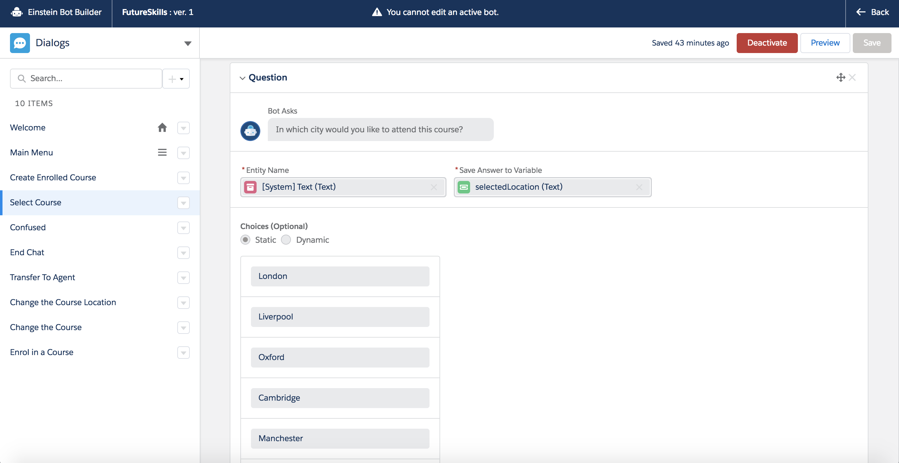
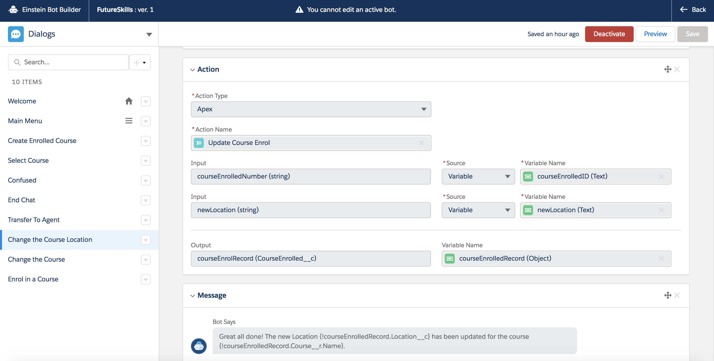

# Apex Invocable Actions

## Presentation deck of "Get Started Building a ChatBot with Einstein Bots" from Dreamforce 28 September 2018
<a href="https://www.slideshare.net/secret/CjvJYDcjZ8Uqjg" target="_blank" alt="Get Started Building a ChatBot with Einstein Bots">Get Started Building a ChatBot with Einstein Bots</a>

## Pre-Requisites for Einstein Bots
<ol type="1">

<li>Feature Licenses: Service Cloud license and Live Agent license</li>

<li>Enable Lightning Experience</li>

<li>Create & Publish a Lightning (Force.com) Site "or" a Salesforce Community</li>

<li>Enable Salesforce Knowledge (optional)</li>

<li><a href="https://help.salesforce.com/articleView?id=security_keys_creating.htm&type=5" target="_blank" alt="Create a Self-Signed Certificate">Create a Self-Signed Certificate</a></li>

<li><a href="https://help.salesforce.com/articleView?id=live_agent_lightning_experience_setup_flow.htm&type=5#live_agent_lightning_experience_setup_flow" target="_blank" alt="Run the Live Agent guided setup flow">Run the Live Agent guided setup flow</a></li>

<li>Enable Einstein Bot and enable/active Deployment Channel Live Agent</li>

<li>Updated Einstein.ai with Self-Signed Certificate</li>

<li>Provide a Snap-ins chat button for your customers on Lightning (Force.com) Site "or" a Salesforce Community</li>

<li>Create Einstein Bot</li>

</ol>

## Key Considerations
<ol type="1">
<li>Update Einstein Bots Configuration under Live Agent > Chat Buttons & Invitations (in Salesforce Classic)</li>
<li>Update Snap-in Chat Deployment Settings (in Lightning Experience)</li>
<li>New Permission Set = <b>sfdc.chatbot.service.permset</b> (Salesforce creates this permission set behind the scene after enabling Einstein Bot and Live Agent channel)</li>
<li><b>Note:</b> This permission set controls what Objects and Apex classes Bots can access in your Salesforce org</li>
</ol>

## Look & Feel in Salesforce
<ol type="1">

<li></li>

<li></li>

<li></li>

<li></li>

<li></li>

<li></li>

<li></li>

<li></li>

<li></li>

<li></li>

<li></li>

<li></li>

<li></li>

<li></li>

<li></li>

<li></li>

<li></li>

<li></li>

<li></li>

<li></li>

<li></li>

<li></li>

<li></li>

<li></li>

</ol>

## Salesforce Success Community Group
<ol type="1">
  
<li><a href="https://success.salesforce.com/_ui/core/chatter/groups/GroupProfilePage?g=0F93A000000LkYMSA0" target="_blank" alt="Service Cloud - Einstein Bots">Service Cloud - Einstein Bots</a></li>

<li><a href="https://success.salesforce.com/_ui/core/chatter/groups/GroupProfilePage?g=0F93A00000020HM" target="_blank" alt="Service Cloud - Einstein Bots - Private - Closed">Service Cloud - Einstein Bots - Private - Closed</a></li>

</ol>

## Einstein Bots Guides
<ol type="1">
  
<li><a href="https://sfdc.co/BotsGuide" target="_blank" alt="for beginners">for beginners</a></li>

<li><a href="https://sfdc.co/BotsGuide2" target="_blank" alt="for intermediates">for intermediates</a></li>

</ol>

## Introduction to Einstein Bots
<ol type="1">
  
<li><a href="https://help.salesforce.com/articleView?id=bots_service_intro.htm&type=5" target="_blank" alt="Einstein Bots for Service Cloud">Einstein Bots for Service Cloud</a></li>

<li><a href="https://trailhead.salesforce.com/modules/service_bots_basics" target="_blank" alt="Trailhead Module - Einstein Bots Basics">Trailhead Module - Einstein Bots Basics</a></li>

<li><a href="https://trailhead.salesforce.com/modules/artificial-intelligence-for-customer-service" target="_blank" alt="Trailhead Module - Artificial Intelligence for Customer Service">Trailhead Module - Artificial Intelligence for Customer Service</a></li>

</ol>

## Einstein Bots in Metadata API & Deployment
<ol type="1">
  
<li><a href="https://developer.salesforce.com/docs/atlas.en-us.api_meta.meta/api_meta/meta_bot.htm" target="_blank" alt="Bot in Metadata API">Bot in Metadata API</a></li>

<li><a href="https://developer.salesforce.com/docs/atlas.en-us.api_meta.meta/api_meta/meta_botversion.htm" target="_blank" alt="BotVersion in Metadata API">BotVersion in Metadata API</a></li>

</ol>

## Salesforce Winter'19 Release
<ol type="1">
  
<li><a href="https://releasenotes.docs.salesforce.com/en-us/winter19/release-notes/rn_service_bots.htm" target="_blank" alt="Einstein Bots: Process Automation Flows, Improved Flexibility, and More Detailed Session Logs">Einstein Bots: Process Automation Flows, Improved Flexibility, and More Detailed Session Logs</a></li>

<li><a href="https://releasenotes.docs.salesforce.com/en-us/winter19/release-notes/rn_forcecom_flow_bots.htm" target="_blank" alt="Use Autolaunched Flows in Einstein Bots—No Coding Required">Use Autolaunched Flows in Einstein Bots—No Coding Required</a></li>

<li><a href="https://releasenotes.docs.salesforce.com/en-us/winter19/release-notes/fsc_bots.htm" target="_blank" alt="Deploy Einstein Bots for Financial Services Cloud">Deploy Einstein Bots for Financial Services Cloud</a></li>

</ol>

## Salesforce Summer'18 Release
<ol type="1">
  
<li><a href="https://releasenotes.docs.salesforce.com/en-us/summer18/release-notes/rn_service_bots.htm" target="_blank" alt="Service Cloud: Einstein Bots to the Rescue: Boost Service Team Productivity with Bots (Generally Available)">Service Cloud: Einstein Bots to the Rescue: Boost Service Team Productivity with Bots (Generally Available)</a></li>

<li><a href="https://developer.salesforce.com/blogs/2018/06/summer18-einstein-bots-for-the-people.html" target="_blank" alt="Einstein Bots For the People">Einstein Bots For the People</a></li>

</ol>

## Apex Invocable Actions
<ol type="1">
  
<li><a href="https://developer.salesforce.com/docs/atlas.en-us.apexcode.meta/apexcode/apex_classes_annotation_InvocableMethod.htm" target="_blank" alt="Apex: InvocableMethod Annotation">Apex: InvocableMethod Annotation</a></li>

<li><a href="https://developer.salesforce.com/docs/atlas.en-us.apexcode.meta/apexcode/apex_classes_annotation_InvocableVariable.htm" target="_blank" alt="Apex: InvocableVariable Annotation">Apex: InvocableVariable Annotation</a></li>

</ol>

## Einstein Bot Sessions on YouTube
<ol type="1">
  
<li><a href="https://www.salesforce.com/video/1756700/" target="_blank" alt="Einstein Agents: How To Set Up Service Cloud Chatbots In A Few Easy Steps">Einstein Agents: How To Set Up Service Cloud Chatbots In A Few Easy Steps</a></li>

<li><a href="https://www.salesforce.com/video/1768002/" target="_blank" alt="Dreamforce 2017 - Einstein Bots: Using AI to Deliver the Future of Customer Service">Dreamforce 2017 - Einstein Bots: Using AI to Deliver the Future of Customer Service</a></li>

<li><a href="https://www.youtube.com/watch?v=i9TbAkRNNa0" target="_blank" alt="Einstein Bots: Build a CRM Powered Chatbot">Einstein Bots: Build a CRM Powered Chatbot</a></li>

<li><a href="https://www.youtube.com/watch?v=Z2v0Dv6nWaI" target="_blank" alt="Salesforce Apex Hours: Einstein Bots">Salesforce Apex Hours: Einstein Bots</a></li>

<li><a href="https://www.youtube.com/watch?v=f-U2xlLjiyE" target="_blank" alt="Service Cloud: Einstein Bots">Service Cloud: Einstein Bots</a></li>

</ol>

## Other Useful Resources
<ol type="1">
  
<li><a href="https://chatbotsmagazine.com/einstein-bots-using-ai-to-deliver-the-future-of-customer-service-b6df3786884f" target="_blank" alt="Einstein Bots: Using AI to deliver the Future of Customer Service">Einstein Bots: Using AI to deliver the Future of Customer Service</a></li>

<li><a href="https://www.salesforce.com/blog/2017/11/the-magic-of-einstein-bot.html" target="_blank" alt="The Magic of Einstein Bot">The Magic of Einstein Bot</a></li>

<li><a href="https://dawidnaude.com/what-does-einstein-bots-mean-for-salesforce-customers-and-partners-80fdcb941a3f" target="_blank" alt="What does Einstein Bots mean for Salesforce customers and partners?">What does Einstein Bots mean for Salesforce customers and partners?</a></li>

<li><a href="https://chatbotsmagazine.com/the-complete-beginner-s-guide-to-chatbots-8280b7b906ca" target="_blank" alt="The Complete Beginner’s Guide To Chatbots">The Complete Beginner’s Guide To Chatbots</a></li>

<li><a href="https://developer.salesforce.com/blogs/developer-relations/2017/03/bot-toolkit-creating-deploying-bots-inside-salesforce.html" target="_blank" alt="A Toolkit for Creating and Deploying Bots Inside Salesforce (Custom ChatBots)">A Toolkit for Creating and Deploying Bots Inside Salesforce (Custom ChatBots)</a></li>

<li><a href="https://www.salesforce.com/products/einstein/ai-deep-dive/" target="_blank" alt="Take a deep dive into artificial intelligence">Take a deep dive into artificial intelligence</a></li>

<li><a href="https://tact.ai/" target="_blank" alt="Amazon, Microsoft, Salesforce">Amazon, Microsoft, Salesforce</a></li>

</ol>
